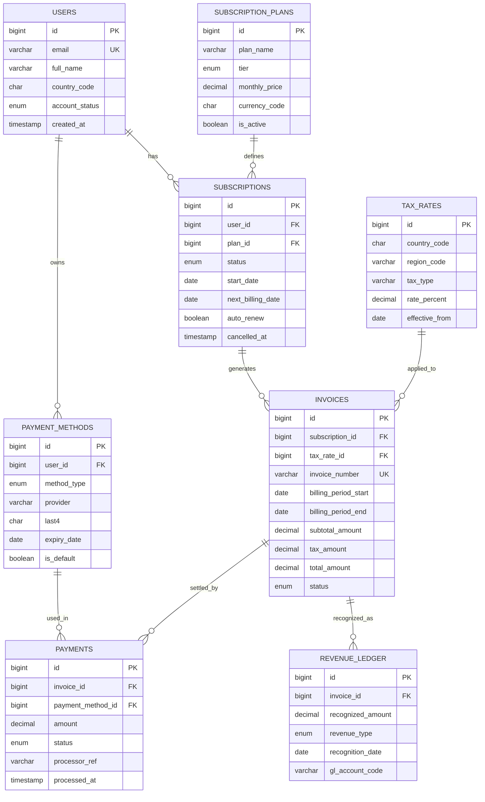
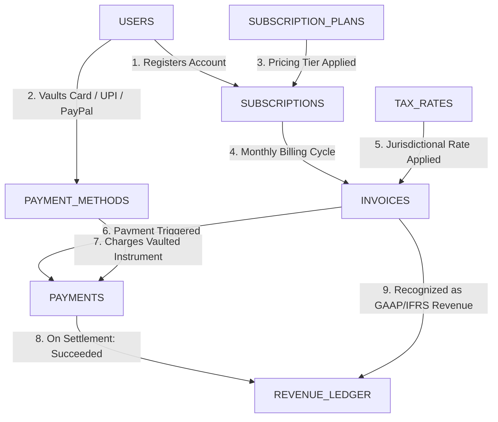

# ⚡ Netflix Billing Database: Live Data & Connection Matrix

> **Live Database Snapshot**: Auto-extracted directly from [`netflix_billing.db`](netflix_billing.db).

- **Database Engine**: SQLite 3 (ACID-Compliant Relational Engine)
- **Total Relational Tables**: 8
- **Total Populated Records**: 102
- **Foreign Key Integrity**: `PRAGMA foreign_key_check;` ➔ **PASSED (0 Violations)**

---

## 🗺️ 1. Interactive Relational Architecture (Mermaid ERD)

---

## 🔄 2. Transactional Lifecycle Pipeline (Mermaid Flowchart)

---

## 🔗 3. Relational Foreign Key Lineage Matrix

| Child Table | Foreign Key Column | Parent Table | Parent Key | Relationship | Cascade Policy | Business Purpose |
| :--- | :--- | :--- | :--- | :--- | :--- | :--- |
| `SUBSCRIPTIONS` | `user_id` | `USERS` | `id` | Many-to-One (N:1) | `ON DELETE CASCADE` | Binds subscriber identity to their plan lifecycle |
| `SUBSCRIPTIONS` | `plan_id` | `SUBSCRIPTION_PLANS` | `id` | Many-to-One (N:1) | `ON DELETE RESTRICT` | Prevents deleting plan tiers with active subscribers |
| `PAYMENT_METHODS` | `user_id` | `USERS` | `id` | Many-to-One (N:1) | `ON DELETE CASCADE` | Associates payment instruments with user account |
| `INVOICES` | `subscription_id` | `SUBSCRIPTIONS` | `id` | Many-to-One (N:1) | `ON DELETE RESTRICT` | Preserves financial billing records against subscription deletions |
| `INVOICES` | `tax_rate_id` | `TAX_RATES` | `id` | Many-to-One (N:1) | `ON DELETE SET NULL` | Records applied tax jurisdiction (GST, VAT, Sales Tax) |
| `PAYMENTS` | `invoice_id` | `INVOICES` | `id` | Many-to-One (N:1) | `ON DELETE CASCADE` | Connects settlement transactions to specific invoice cycle |
| `PAYMENTS` | `payment_method_id` | `PAYMENT_METHODS` | `id` | Many-to-One (N:1) | `ON DELETE RESTRICT` | Records vaulted instrument used for charge settlement |
| `REVENUE_LEDGER` | `invoice_id` | `INVOICES` | `id` | Many-to-One (N:1) | `ON DELETE CASCADE` | Double-entry journal entries for accounting recognition (ASC 606) |

---

## 📋 4. Complete Live Table Records

### 🗃️ `USERS` — User Master Vault (15 records)

| id | email | full_name | country_code | account_status | created_at |
| :--- | :--- | :--- | :--- | :--- | :--- |
| 1 | suryaansh.singh@ultron.internal | Suryaansh Singh | IN | 🟢 `ACTIVE` | 2024-01-10 10:15:00 |
| 2 | tony.stark@starkindustries.com | Tony Stark | US | 🟢 `ACTIVE` | 2024-01-15 08:30:00 |
| 3 | bruce.wayne@waynecorp.com | Bruce Wayne | US | 🟢 `ACTIVE` | 2024-02-01 12:00:00 |
| 4 | peter.parker@dailybugle.com | Peter Parker | US | 🟢 `ACTIVE` | 2024-02-14 16:45:00 |
| 5 | natasha.romanoff@avengers.org | Natasha Romanoff | GB | 🟢 `ACTIVE` | 2024-03-01 09:20:00 |
| 6 | wanda.maximoff@westview.net | Wanda Maximoff | DE | 🟢 `ACTIVE` | 2024-03-12 14:10:00 |
| 7 | clark.kent@planet.com | Clark Kent | US | 🟢 `ACTIVE` | 2024-03-20 11:05:00 |
| 8 | barry.allen@star-labs.org | Barry Allen | US | 🟢 `ACTIVE` | 2024-04-05 18:40:00 |
| 9 | diana.prince@themyscira.gov | Diana Prince | GB | 🟢 `ACTIVE` | 2024-04-18 07:50:00 |
| 10 | priya.sharma@techcorp.in | Priya Sharma | IN | 🟢 `ACTIVE` | 2024-05-01 13:30:00 |
| 11 | arjun.verma@bangalore.in | Arjun Verma | IN | ⚪ `CANCELLED` | 2024-05-10 15:20:00 |
| 12 | hans.gruber@nakatomi.de | Hans Gruber | DE | 🔴 `SUSPENDED` | 2024-05-25 19:15:00 |
| 13 | miles.morales@brooklyn.edu | Miles Morales | US | 🟡 `PENDING` | 2024-06-01 21:00:00 |
| 14 | neha.patel@mumbai.in | Neha Patel | IN | 🟢 `ACTIVE` | 2024-06-05 10:00:00 |
| 15 | arthur.curry@atlantis.oceans | Arthur Curry | US | 🟢 `ACTIVE` | 2024-06-15 17:30:00 |

### 🗃️ `SUBSCRIPTION_PLANS` — Tier Catalog & Price Matrix (9 records)

| id | plan_name | tier | monthly_price | currency_code | is_active |
| :--- | :--- | :--- | :--- | :--- | :--- |
| 1 | Standard with Ads (US) | STANDARD_WITH_ADS | 6.99 | USD | 1 |
| 2 | Basic (US - Legacy) | BASIC | 9.99 | USD | 0 |
| 3 | Standard 1080p (US) | STANDARD | 15.49 | USD | 1 |
| 4 | Premium 4K+HDR (US) | PREMIUM | 22.99 | USD | 1 |
| 5 | Mobile Only (India) | BASIC | 149 | INR | 1 |
| 6 | Standard HD (India) | STANDARD | 499 | INR | 1 |
| 7 | Premium Ultra HD (India) | PREMIUM | 649 | INR | 1 |
| 8 | Standard mit Werbung (DE) | STANDARD_WITH_ADS | 4.99 | EUR | 1 |
| 9 | Premium 4K (UK) | PREMIUM | 17.99 | GBP | 1 |

### 🗃️ `TAX_RATES` — Jurisdiction & Tax Registry (10 records)

| id | country_code | region_code | tax_type | rate_percent | effective_from |
| :--- | :--- | :--- | :--- | :--- | :--- |
| 1 | US | CA | State Sales Tax | 9.5 | 2024-01-01 |
| 2 | US | NY | State & Local Sales Tax | 8.875 | 2024-01-01 |
| 3 | US | TX | Sales Tax | 8.25 | 2024-01-01 |
| 4 | US | DE | Zero State Tax | 0 | 2024-01-01 |
| 5 | IN | DL | GST (Integrated) | 18 | 2023-01-01 |
| 6 | IN | MH | GST (Dual Central/State) | 18 | 2023-01-01 |
| 7 | IN | KA | GST (Dual Central/State) | 18 | 2023-01-01 |
| 8 | GB | ENG | UK Standard VAT | 20 | 2023-01-01 |
| 9 | DE | BE | Mehrwertsteuer (VAT) | 19 | 2023-01-01 |
| 10 | JP | 13 | Japanese Consumption Tax | 10 | 2023-01-01 |

### 🗃️ `SUBSCRIPTIONS` — Active & Lifecycle Subscriptions (14 records)

| id | user_id | plan_id | status | start_date | next_billing_date | auto_renew | cancelled_at |
| :--- | :--- | :--- | :--- | :--- | :--- | :--- | :--- |
| 1 | 1 | 7 | 🟢 `ACTIVE` | 2024-01-10 | 2024-09-10 | 1 | *(null)* |
| 2 | 2 | 4 | 🟢 `ACTIVE` | 2024-01-15 | 2024-09-15 | 1 | *(null)* |
| 3 | 3 | 4 | 🟢 `ACTIVE` | 2024-02-01 | 2024-09-01 | 1 | *(null)* |
| 4 | 4 | 1 | 🟢 `ACTIVE` | 2024-02-14 | 2024-09-14 | 1 | *(null)* |
| 5 | 5 | 9 | 🟢 `ACTIVE` | 2024-03-01 | 2024-09-01 | 1 | *(null)* |
| 6 | 6 | 8 | 🟢 `ACTIVE` | 2024-03-12 | 2024-09-12 | 1 | *(null)* |
| 7 | 7 | 3 | 🟢 `ACTIVE` | 2024-03-20 | 2024-09-20 | 1 | *(null)* |
| 8 | 8 | 3 | 🔴 `PAST_DUE` | 2024-04-05 | 2024-08-05 | 1 | *(null)* |
| 9 | 9 | 9 | 🟢 `ACTIVE` | 2024-04-18 | 2024-09-18 | 1 | *(null)* |
| 10 | 10 | 6 | 🟢 `ACTIVE` | 2024-05-01 | 2024-09-01 | 1 | *(null)* |
| 11 | 11 | 5 | ⚪ `CANCELLED` | 2024-05-10 | *(null)* | 0 | 2024-07-15 14:00:00 |
| 12 | 12 | 8 | 🟡 `PAUSED` | 2024-05-25 | 2024-10-01 | 0 | *(null)* |
| 13 | 14 | 7 | 🟢 `ACTIVE` | 2024-06-05 | 2024-09-05 | 1 | *(null)* |
| 14 | 15 | 3 | 🟢 `ACTIVE` | 2024-06-15 | 2024-09-15 | 1 | *(null)* |

### 🗃️ `PAYMENT_METHODS` — Tokenized Payment Vault (15 records)

| id | user_id | method_type | provider | last4 | expiry_date | is_default |
| :--- | :--- | :--- | :--- | :--- | :--- | :--- |
| 1 | 1 | UPI | Google Pay / HDFC Bank | 8821 | 2028-12-31 | 1 |
| 2 | 1 | DEBIT_CARD | HDFC Bank Visa Platinum | 4129 | 2027-08-31 | 0 |
| 3 | 2 | CREDIT_CARD | Stark Centurion Black Amex | 0001 | 2029-05-31 | 1 |
| 4 | 3 | CREDIT_CARD | Gotham Chase Sapphire Reserve | 9944 | 2028-10-31 | 1 |
| 5 | 4 | DEBIT_CARD | Queens Community Federal Visa | 3312 | 2025-11-30 | 1 |
| 6 | 5 | CREDIT_CARD | Barclays Premier Mastercard | 7714 | 2027-04-30 | 1 |
| 7 | 6 | DEBIT_CARD | Deutsche Bank Maestro | 6190 | 2026-09-30 | 1 |
| 8 | 7 | CREDIT_CARD | Metropolis Daily Credit Union Visa | 5512 | 2026-03-31 | 1 |
| 9 | 8 | CREDIT_CARD | Central City Wells Fargo Visa | 1082 | 2024-08-31 | 1 |
| 10 | 9 | PAYPAL | PayPal UK Balance | 9411 | 2029-01-01 | 1 |
| 11 | 10 | UPI | PhonePe / ICICI Bank | 3391 | 2028-06-30 | 1 |
| 12 | 11 | DEBIT_CARD | State Bank of India RuPay | 7210 | 2025-07-31 | 1 |
| 13 | 12 | CREDIT_CARD | Commerzbank Visa Gold | 8899 | 2024-02-28 | 1 |
| 14 | 14 | CREDIT_CARD | Axis Bank Neo Mastercard | 2488 | 2027-11-30 | 1 |
| 15 | 15 | GIFT_CARD | Netflix Prepaid Global | 4002 | 2025-12-31 | 1 |

### 🗃️ `INVOICES` — Billing Period Invoices (14 records)

| id | subscription_id | tax_rate_id | invoice_number | billing_period_start | billing_period_end | subtotal_amount | tax_amount | total_amount | status |
| :--- | :--- | :--- | :--- | :--- | :--- | :--- | :--- | :--- | :--- |
| 1 | 1 | 6 | INV-2024-08-00101 | 2024-08-10 | 2024-09-09 | 649 | 116.82 | 765.82 | 🟢 `PAID` |
| 2 | 2 | 1 | INV-2024-08-00102 | 2024-08-15 | 2024-09-14 | 22.99 | 2.18 | 25.17 | 🟢 `PAID` |
| 3 | 3 | 2 | INV-2024-08-00103 | 2024-08-01 | 2024-08-31 | 22.99 | 2.04 | 25.03 | 🟢 `PAID` |
| 4 | 4 | 2 | INV-2024-08-00104 | 2024-08-14 | 2024-09-13 | 6.99 | 0.62 | 7.61 | 🟢 `PAID` |
| 5 | 5 | 8 | INV-2024-08-00105 | 2024-08-01 | 2024-08-31 | 17.99 | 3.6 | 21.59 | 🟢 `PAID` |
| 6 | 6 | 9 | INV-2024-08-00106 | 2024-08-12 | 2024-09-11 | 4.99 | 0.95 | 5.94 | 🟢 `PAID` |
| 7 | 7 | 3 | INV-2024-08-00107 | 2024-08-20 | 2024-09-19 | 15.49 | 1.28 | 16.77 | 🟢 `PAID` |
| 8 | 8 | 1 | INV-2024-08-00108 | 2024-08-05 | 2024-09-04 | 15.49 | 1.47 | 16.96 | 🔴 `UNCOLLECTIBLE` |
| 9 | 9 | 8 | INV-2024-08-00109 | 2024-08-18 | 2024-09-17 | 17.99 | 3.6 | 21.59 | 🟢 `PAID` |
| 10 | 10 | 7 | INV-2024-08-00110 | 2024-08-01 | 2024-08-31 | 499 | 89.82 | 588.82 | 🟢 `PAID` |
| 11 | 13 | 6 | INV-2024-08-00111 | 2024-08-05 | 2024-09-04 | 649 | 116.82 | 765.82 | 🟢 `PAID` |
| 12 | 14 | 4 | INV-2024-08-00112 | 2024-08-15 | 2024-09-14 | 15.49 | 0 | 15.49 | 🟢 `PAID` |
| 13 | 1 | 6 | INV-2024-09-00201 | 2024-09-10 | 2024-10-09 | 649 | 116.82 | 765.82 | 🟡 `ISSUED` |
| 14 | 2 | 1 | INV-2024-09-00202 | 2024-09-15 | 2024-10-14 | 22.99 | 2.18 | 25.17 | 🟡 `DRAFT` |

### 🗃️ `PAYMENTS` — Settlement Transactions (14 records)

| id | invoice_id | payment_method_id | amount | status | processor_ref | processed_at |
| :--- | :--- | :--- | :--- | :--- | :--- | :--- |
| 1 | 1 | 1 | 765.82 | 🟢 `SUCCEEDED` | ch_upi_hdfc_839103984 | 2024-08-10 10:15:02 |
| 2 | 2 | 3 | 25.17 | 🟢 `SUCCEEDED` | ch_amex_stark_99182371 | 2024-08-15 08:30:10 |
| 3 | 3 | 4 | 25.03 | 🟢 `SUCCEEDED` | ch_chase_wayne_4918231 | 2024-08-01 12:00:15 |
| 4 | 4 | 5 | 7.61 | 🟢 `SUCCEEDED` | ch_visa_parker_1182390 | 2024-08-14 16:45:03 |
| 5 | 5 | 6 | 21.59 | 🟢 `SUCCEEDED` | ch_mc_natasha_8823190 | 2024-08-01 09:20:22 |
| 6 | 6 | 7 | 5.94 | 🟢 `SUCCEEDED` | ch_db_wanda_7719283 | 2024-08-12 14:10:05 |
| 7 | 7 | 8 | 16.77 | 🟢 `SUCCEEDED` | ch_cu_kent_3391823 | 2024-08-20 11:05:44 |
| 8 | 8 | 9 | 16.96 | 🔴 `FAILED` | ch_wf_allen_declined_nsf | 2024-08-05 18:40:02 |
| 9 | 9 | 10 | 21.59 | 🟢 `SUCCEEDED` | ch_pp_diana_9948123 | 2024-08-18 07:50:33 |
| 10 | 10 | 11 | 588.82 | 🟢 `SUCCEEDED` | ch_upi_priya_5519283 | 2024-08-01 13:30:18 |
| 11 | 11 | 14 | 765.82 | 🟢 `SUCCEEDED` | ch_axis_neha_2281938 | 2024-08-05 10:00:09 |
| 12 | 12 | 15 | 15.49 | 🟢 `SUCCEEDED` | ch_gift_arthur_1182391 | 2024-08-15 17:30:55 |
| 13 | 8 | 9 | 16.96 | 🔴 `FAILED` | ch_wf_allen_retry_declined | 2024-08-08 12:00:00 |
| 14 | 1 | 1 | 765.82 | 🟡 `PENDING` | ch_upi_hdfc_sept_pending | 2024-09-10 10:15:00 |

### 🗃️ `REVENUE_LEDGER` — ASC 606 Revenue Recognition Ledger (11 records)

| id | invoice_id | recognized_amount | revenue_type | recognition_date | gl_account_code |
| :--- | :--- | :--- | :--- | :--- | :--- |
| 1 | 1 | 649 | SUBSCRIPTION | 2024-08-10 | 4010-STREAMING-SUB-IN |
| 2 | 2 | 22.99 | SUBSCRIPTION | 2024-08-15 | 4010-STREAMING-SUB-US |
| 3 | 3 | 22.99 | SUBSCRIPTION | 2024-08-01 | 4010-STREAMING-SUB-US |
| 4 | 4 | 6.99 | AD_REVENUE | 2024-08-14 | 4020-AD-SUPPORTED-SUB-US |
| 5 | 5 | 17.99 | SUBSCRIPTION | 2024-08-01 | 4010-STREAMING-SUB-GB |
| 6 | 6 | 4.99 | AD_REVENUE | 2024-08-12 | 4020-AD-SUPPORTED-SUB-DE |
| 7 | 7 | 15.49 | SUBSCRIPTION | 2024-08-20 | 4010-STREAMING-SUB-US |
| 8 | 9 | 17.99 | SUBSCRIPTION | 2024-08-18 | 4010-STREAMING-SUB-GB |
| 9 | 10 | 499 | SUBSCRIPTION | 2024-08-01 | 4010-STREAMING-SUB-IN |
| 10 | 11 | 649 | SUBSCRIPTION | 2024-08-05 | 4010-STREAMING-SUB-IN |
| 11 | 12 | 15.49 | SUBSCRIPTION | 2024-08-15 | 4010-STREAMING-SUB-US |

---

## 🔍 5. End-to-End Relational Journey Walkthrough

### Journey A: Successful Billing Cycle (Subscriber: Suryaansh Singh)
1. **User**: `id = 1` (`Suryaansh Singh`, `IN`, `ACTIVE`)
2. **Subscription**: `id = 1` ➔ Plan `id = 7` (*Premium Ultra HD - India*, `649.00 INR`)
3. **Payment Method**: `id = 1` ➔ Tokenized `UPI` via `Google Pay / HDFC Bank` (`last4 = 8821`, `is_default = 1`)
4. **Tax Calculation**: Tax Rate `id = 6` ➔ Maharashtra GST `18.00%` on `649.00 INR` subtotal = `116.82 INR` tax
5. **Invoice Generated**: `id = 1` (`INV-2024-08-00101`) ➔ Subtotal `649.00` + Tax `116.82` = Total `765.82 INR` (Status: 🟢 `PAID`)
6. **Payment Settled**: `id = 1` ➔ Charged `765.82 INR` via Method `1`, Processor Ref: `ch_upi_hdfc_839103984` (Status: 🟢 `SUCCEEDED`)
7. **Revenue Recognition**: `id = 1` ➔ Recognized `649.00 INR` to GL Account `4010-STREAMING-SUB-IN` (Type: `SUBSCRIPTION`)

### Journey B: Delinquency & Past-Due Handling (Subscriber: Barry Allen)
1. **User**: `id = 8` (`Barry Allen`, `US`, `ACTIVE`)
2. **Subscription**: `id = 8` ➔ Status: 🔴 `PAST_DUE` (Plan `id = 3`, *Standard 1080p US*, `15.49 USD`)
3. **Invoice**: `id = 8` (`INV-2024-08-00108`) ➔ Total: `16.96 USD` (Status: 🔴 `UNCOLLECTIBLE`)
4. **Payment Attempts**: `id = 8` and `id = 13` ➔ Status: 🔴 `FAILED` (Processor error: `ch_wf_allen_declined_nsf` / `ch_wf_allen_retry_declined`)
5. **Revenue Recognition**: **Zero recognized revenue** — protects financial books from delinquent accounts.

