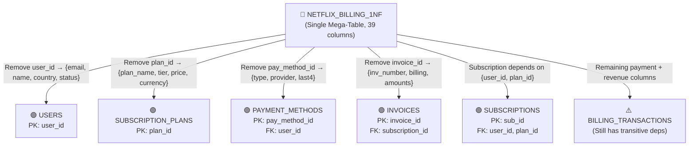
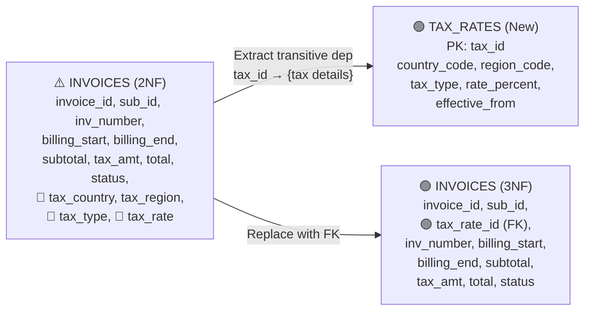
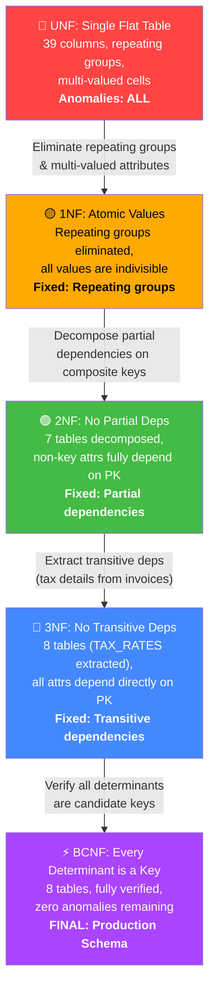
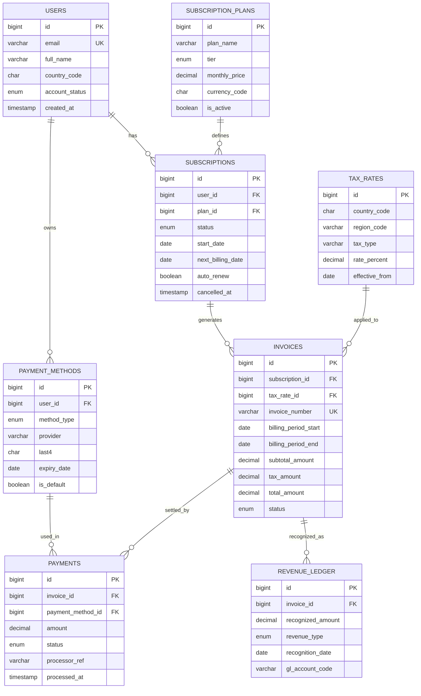

# 🎬 Netflix Billing & Subscription Database

Autonomous Relational Database Engine built from `netflix_billing_schema_erd.html`.  
Implemented using **SQLite 3**, the industry-standard lightweight, serverless, zero-configuration SQL relational database engine.

> ⚡ **Live Database Telemetry**: View all table records, relational foreign key lineages, and transaction flowcharts in [**`LIVE_DATABASE.md`**](LIVE_DATABASE.md).

---

## 📌 1. Project Overview & Architecture

This database models a production-grade billing, invoicing, and subscription lifecycle system for Netflix. It handles:
- Multi-tier subscription plans across international currencies (`USD`, `INR`, `EUR`, `GBP`).
- Multi-method user payment vaults (Credit Card, Debit Card, UPI, PayPal, Gift Cards).
- Multi-jurisdiction tax engine (US State sales taxes, India GST 18%, UK VAT 20%, Germany Mehrwertsteuer 19%).
- Automated billing cycle invoicing (Subtotal + Calculated Tax = Total).
- Payment settlement and gateway transaction tracking (`SUCCEEDED`, `FAILED`, `PENDING`).
- Revenue recognition journal ledger compliant with accounting standards (ASC 606 / IFRS 15).

---

## 📐 2. Database Normalization: Step-by-Step Walkthrough

This section demonstrates the **formal normalization process** applied to the Netflix Billing database, progressing through each Normal Form from an unnormalized flat table to the final **Boyce-Codd Normal Form (BCNF)** decomposition.

### 🔴 Step 0: Unnormalized Form (UNF) — The Raw Flat Table

Imagine all Netflix billing data dumped into **one massive spreadsheet** with no structure. A single row attempts to capture a user, their plan, payment method, invoice, tax, payment transaction, and revenue recognition — all at once.

**`NETFLIX_BILLING_FLAT`** (Hypothetical Single Table):

| user_id | email | full_name | country | status | plan_name | tier | price | currency | tax_country | tax_region | tax_type | tax_rate | invoice_no | billing_start | billing_end | subtotal | tax_amt | total | pay_method_type | pay_provider | pay_last4 | pay_expiry | pay_amount | pay_status | processor_ref | revenue_type | gl_account |
|---|---|---|---|---|---|---|---|---|---|---|---|---|---|---|---|---|---|---|---|---|---|---|---|---|---|---|---|
| 1 | suryaansh@... | Suryaansh Singh | IN | ACTIVE | Premium Ultra HD (India) | PREMIUM | 649 | INR | IN | MH | GST 18% | 18.0 | INV-2024-08-00101 | 2024-08-10 | 2024-09-09 | 649 | 116.82 | 765.82 | UPI, DEBIT_CARD | Google Pay / HDFC, HDFC Visa | 8821, 4129 | 2028-12, 2027-08 | 765.82 | SUCCEEDED | ch_upi_hdfc_839... | SUBSCRIPTION | 4010-STREAMING-SUB-IN |

#### ❌ Problems with UNF:
- **Repeating groups**: Payment methods stored as comma-separated lists (`UPI, DEBIT_CARD`)
- **Multi-valued cells**: Provider, last4, expiry packed into single columns
- **Massive redundancy**: User info repeated for every invoice row
- **No atomic values**: Cannot query individual payment methods
- **Update anomalies**: Changing a user's email requires updating dozens of rows
- **Delete anomalies**: Deleting the last invoice for a user would lose all user data
- **Insert anomalies**: Cannot add a new subscription plan without a linked user

---

### 🟡 Step 1: First Normal Form (1NF) — Eliminate Repeating Groups

> **1NF Rule**: Every column must contain **atomic (indivisible) values**. No repeating groups or arrays. Each row must be uniquely identifiable.

**Action Taken**: Split multi-valued payment method columns into separate rows. Assign a composite key to uniquely identify each record.

**`NETFLIX_BILLING_1NF`** (Flattened — one payment method per row):

| user_id | email | full_name | country | account_status | plan_name | tier | price | currency | is_plan_active | sub_status | start_date | next_billing | auto_renew | pay_method_id | method_type | provider | last4 | expiry | is_default | tax_country | tax_region | tax_type | tax_rate | invoice_no | billing_start | billing_end | subtotal | tax_amt | total | inv_status | pay_amount | pay_status | processor_ref | processed_at | revenue_type | recognized_amt | recognition_date | gl_account |
|---|---|---|---|---|---|---|---|---|---|---|---|---|---|---|---|---|---|---|---|---|---|---|---|---|---|---|---|---|---|---|---|---|---|---|---|---|---|---|
| 1 | suryaansh@... | Suryaansh Singh | IN | ACTIVE | Premium Ultra HD (India) | PREMIUM | 649 | INR | 1 | ACTIVE | 2024-01-10 | 2024-09-10 | 1 | 1 | UPI | Google Pay/HDFC | 8821 | 2028-12-31 | 1 | IN | MH | GST 18% | 18.0 | INV-2024-08-00101 | 2024-08-10 | 2024-09-09 | 649 | 116.82 | 765.82 | PAID | 765.82 | SUCCEEDED | ch_upi_hdfc... | 2024-08-10 | SUBSCRIPTION | 649 | 2024-08-10 | 4010-SUB-IN |
| 1 | suryaansh@... | Suryaansh Singh | IN | ACTIVE | Premium Ultra HD (India) | PREMIUM | 649 | INR | 1 | ACTIVE | 2024-01-10 | 2024-09-10 | 1 | 2 | DEBIT_CARD | HDFC Visa Plat. | 4129 | 2027-08-31 | 0 | IN | MH | GST 18% | 18.0 | INV-2024-08-00101 | 2024-08-10 | 2024-09-09 | 649 | 116.82 | 765.82 | PAID | 765.82 | SUCCEEDED | ch_upi_hdfc... | 2024-08-10 | SUBSCRIPTION | 649 | 2024-08-10 | 4010-SUB-IN |

#### ✅ 1NF Achieved:
- ✅ All values are **atomic** (one payment method per row)
- ✅ Each row is uniquely identifiable by composite key
- ✅ No repeating groups or arrays

#### ❌ Remaining Problems:
- **Massive data redundancy** — user name, email, plan, tax info duplicated across every row
- **Partial dependencies** — `full_name` depends only on `user_id`, not the full composite key
- **Update anomaly** — renaming a plan requires updating hundreds of rows
- **Transitive dependencies** — `tax_type` depends on `tax_country + tax_region`, not on the invoice

---

### 🟢 Step 2: Second Normal Form (2NF) — Eliminate Partial Dependencies

> **2NF Rule**: Must be in 1NF + **every non-key attribute must depend on the entire primary key** (no partial dependencies on a subset of a composite key).

**Functional Dependency Analysis** on the 1NF table:

```
Composite Key: {user_id, plan_id, pay_method_id, invoice_id, payment_id, revenue_id}

Partial Dependencies Found (depend on PART of the key):
  user_id → email, full_name, country, account_status, created_at
  plan_id → plan_name, tier, monthly_price, currency_code, is_active
  pay_method_id → method_type, provider, last4, expiry_date, is_default
  invoice_id → invoice_number, billing_period_start/end, subtotal, tax, total, inv_status
  {user_id, plan_id} → sub_status, start_date, next_billing, auto_renew, cancelled_at
```

**Action Taken**: Decompose into separate tables, each with attributes fully dependent on their own primary key.

**Decomposition into 2NF**:



**Resulting 2NF Tables**:

| New Table | Primary Key | Attributes | Extracted From |
|:---|:---|:---|:---|
| **`USERS`** | `user_id` | email, full_name, country_code, account_status, created_at | Partial dep on `user_id` |
| **`SUBSCRIPTION_PLANS`** | `plan_id` | plan_name, tier, monthly_price, currency_code, is_active | Partial dep on `plan_id` |
| **`SUBSCRIPTIONS`** | `sub_id` | user_id (FK), plan_id (FK), status, start_date, next_billing_date, auto_renew, cancelled_at | Partial dep on `{user_id, plan_id}` |
| **`PAYMENT_METHODS`** | `pay_method_id` | user_id (FK), method_type, provider, last4, expiry_date, is_default | Partial dep on `pay_method_id` |
| **`INVOICES`** | `invoice_id` | subscription_id (FK), invoice_number, billing_start, billing_end, subtotal, tax_amt, total, status, *tax_country, tax_region, tax_type, tax_rate* | Partial dep on `invoice_id` |
| **`PAYMENTS`** | `payment_id` | invoice_id (FK), pay_method_id (FK), amount, status, processor_ref, processed_at | Partial dep on `payment_id` |
| **`REVENUE_LEDGER`** | `revenue_id` | invoice_id (FK), recognized_amount, revenue_type, recognition_date, gl_account_code | Partial dep on `revenue_id` |

#### ✅ 2NF Achieved:
- ✅ All partial dependencies eliminated
- ✅ Each non-key attribute fully depends on its table's entire primary key
- ✅ User data stored once, plan data stored once, etc.

#### ❌ Remaining Problems:
- **Transitive dependency in INVOICES**: Tax attributes (`tax_country`, `tax_region`, `tax_type`, `tax_rate`) depend on a **tax jurisdiction**, not on the invoice itself:
  ```
  invoice_id → tax_id → {tax_country, tax_region, tax_type, tax_rate, effective_from}
  ```
  This is a transitive dependency: a non-key column (`tax_id`) determines other non-key columns.

---

### 🔵 Step 3: Third Normal Form (3NF) — Eliminate Transitive Dependencies

> **3NF Rule**: Must be in 2NF + **no non-key attribute can transitively depend on the primary key** through another non-key attribute. (Every non-key attribute must depend *directly* on the primary key and nothing else.)

**Transitive Dependency Found in INVOICES (2NF)**:

```
INVOICES table:
  invoice_id → tax_country, tax_region, tax_type, tax_rate_percent, effective_from

  But actually:
  invoice_id → tax_id  (which tax jurisdiction applies)
  tax_id → tax_country, tax_region, tax_type, tax_rate_percent, effective_from

  Therefore: invoice_id → tax_id → {tax details}  ← TRANSITIVE!
```

**Action Taken**: Extract the tax attributes into a dedicated `TAX_RATES` table, and store only the `tax_rate_id` foreign key in `INVOICES`.



**Full 3NF Schema (8 Tables)**:

| Table | Primary Key | Foreign Keys | Non-Key Attributes |
|:---|:---|:---|:---|
| **`USERS`** | `id` | — | email, full_name, country_code, account_status, created_at |
| **`SUBSCRIPTION_PLANS`** | `id` | — | plan_name, tier, monthly_price, currency_code, is_active |
| **`TAX_RATES`** | `id` | — | country_code, region_code, tax_type, rate_percent, effective_from |
| **`SUBSCRIPTIONS`** | `id` | user_id → USERS, plan_id → PLANS | status, start_date, next_billing_date, auto_renew, cancelled_at |
| **`PAYMENT_METHODS`** | `id` | user_id → USERS | method_type, provider, last4, expiry_date, is_default |
| **`INVOICES`** | `id` | subscription_id → SUBS, tax_rate_id → TAX_RATES | invoice_number, billing_period_start/end, subtotal, tax_amount, total_amount, status |
| **`PAYMENTS`** | `id` | invoice_id → INVOICES, payment_method_id → PAY_METHODS | amount, status, processor_ref, processed_at |
| **`REVENUE_LEDGER`** | `id` | invoice_id → INVOICES | recognized_amount, revenue_type, recognition_date, gl_account_code |

#### ✅ 3NF Achieved:
- ✅ No transitive dependencies remain
- ✅ All non-key attributes depend **directly and only** on their primary key
- ✅ Tax jurisdictions are independently maintainable without touching invoices

---

### ⚡ Step 4: Boyce-Codd Normal Form (BCNF) — Final Verification

> **BCNF Rule**: Must be in 3NF + **every determinant must be a candidate key**. (For every functional dependency X → Y, X must be a superkey.)

**BCNF Verification for Each Table**:

| Table | Candidate Keys | All Determinants | BCNF? | Reasoning |
|:---|:---|:---|:---|:---|
| **`USERS`** | `{id}`, `{email}` | `id → all`, `email → all` | ✅ **Yes** | Both determinants are candidate keys |
| **`SUBSCRIPTION_PLANS`** | `{id}` | `id → all` | ✅ **Yes** | Single candidate key; only determinant |
| **`TAX_RATES`** | `{id}`, `{country_code, region_code, tax_type, effective_from}` | `id → all` | ✅ **Yes** | Determinant is a superkey |
| **`SUBSCRIPTIONS`** | `{id}` | `id → all` | ✅ **Yes** | Single candidate key; only determinant |
| **`PAYMENT_METHODS`** | `{id}` | `id → all` | ✅ **Yes** | Single candidate key; only determinant |
| **`INVOICES`** | `{id}`, `{invoice_number}` | `id → all`, `invoice_number → all` | ✅ **Yes** | Both determinants are candidate keys |
| **`PAYMENTS`** | `{id}` | `id → all` | ✅ **Yes** | Single candidate key; only determinant |
| **`REVENUE_LEDGER`** | `{id}` | `id → all` | ✅ **Yes** | Single candidate key; only determinant |

#### ✅ BCNF Achieved:
- ✅ **Every determinant in every table is a candidate key**
- ✅ No functional dependency anomalies remain
- ✅ All update, insert, and delete anomalies are eliminated
- ✅ The schema is in the **highest practical normal form**

---

### 📊 Normalization Summary: Transformation Journey



| Normal Form | Tables | Key Action | Anomalies Eliminated |
|:---|:---:|:---|:---|
| **UNF** | 1 | Raw flat data dump | None (all anomalies present) |
| **1NF** | 1 | Atomic values, no repeating groups | Multi-valued cells, repeating groups |
| **2NF** | 7 | Remove partial dependencies | Update anomaly (redundant user/plan data) |
| **3NF** | 8 | Remove transitive dependencies | Tax data redundancy in invoices |
| **BCNF** | 8 | Verify every determinant is a candidate key | All remaining FD anomalies |

---

## 🗄️ 3. Final BCNF Entity Relationship Diagram (Production Schema)



### Table Breakdown (8 Relational Tables — BCNF Verified)

| Table | Primary Key | Foreign Keys | Key Constraints & Details |
| :--- | :--- | :--- | :--- |
| **`USERS`** | `id` | - | `email` UNIQUE, `account_status` CHECK ENUM (`ACTIVE`, `SUSPENDED`, `CANCELLED`, `PENDING`) |
| **`SUBSCRIPTION_PLANS`** | `id` | - | `tier` CHECK ENUM (`STANDARD_WITH_ADS`, `BASIC`, `STANDARD`, `PREMIUM`), `monthly_price`, `currency_code` |
| **`TAX_RATES`** | `id` | - | `country_code`, `region_code`, `tax_type`, `rate_percent`, `effective_from` |
| **`SUBSCRIPTIONS`** | `id` | `user_id` -> `USERS(id)`<br>`plan_id` -> `SUBSCRIPTION_PLANS(id)` | `status` CHECK ENUM (`ACTIVE`, `PAST_DUE`, `CANCELLED`, `PAUSED`), `start_date`, `next_billing_date` |
| **`PAYMENT_METHODS`** | `id` | `user_id` -> `USERS(id)` | `method_type` CHECK ENUM (`CREDIT_CARD`, `DEBIT_CARD`, `PAYPAL`, `UPI`, `GIFT_CARD`), `last4`, `is_default` |
| **`INVOICES`** | `id` | `subscription_id` -> `SUBSCRIPTIONS(id)`<br>`tax_rate_id` -> `TAX_RATES(id)` | `invoice_number` UNIQUE, `subtotal_amount`, `tax_amount`, `total_amount`, `status` |
| **`PAYMENTS`** | `id` | `invoice_id` -> `INVOICES(id)`<br>`payment_method_id` -> `PAYMENT_METHODS(id)` | `amount`, `status` CHECK ENUM (`PENDING`, `SUCCEEDED`, `FAILED`, `REFUNDED`), `processor_ref` |
| **`REVENUE_LEDGER`** | `id` | `invoice_id` -> `INVOICES(id)` | `recognized_amount`, `revenue_type` CHECK ENUM (`SUBSCRIPTION`, `ADD_ON`, `AD_REVENUE`, `PENALTY`), `gl_account_code` |

---

## 🚀 4. Quick Start & Execution Guide

### Database Location:
- Target Database: `/home/ultron/Projects/netflix_billing_db/netflix_billing.db`
- DDL Schema: `/home/ultron/Projects/netflix_billing_db/schema.sql`
- Pure SQL Seed: `/home/ultron/Projects/netflix_billing_db/seed.sql`
- Automated Populator: `/home/ultron/Projects/netflix_billing_db/populate_db.py`
- Analytical Queries: `/home/ultron/Projects/netflix_billing_db/queries.sql`
- Terminal Explorer: `/home/ultron/Projects/netflix_billing_db/explore.py`
- Dedicated CLI Command: `/home/ultron/.local/bin/sql-netflix`

### ⚡ Global CLI Command: `sql-netflix`
Available globally in your terminal:
```bash
# 1. Launch interactive boxed SQL console (prompts for queries)
sql-netflix

# 2. Run a direct query with boxed terminal output
sql-netflix "SELECT id, full_name, email, country_code FROM USERS LIMIT 5;"

# 3. View database table counts matrix
sql-netflix tables

# 4. Run the assignment analytical query suite
sql-netflix queries
```

### 1. Rebuild or Reset the Database
```bash
cd /home/ultron/Projects/netflix_billing_db
python3 populate_db.py
```

### 2. Inspect Records with the ULTRON Explorer CLI
```bash
# View table record count matrix
./explore.py summary

# View specific tables
./explore.py users
./explore.py plans
./explore.py subscriptions
./explore.py invoices
./explore.py payments
./explore.py ledger
```

### 3. Open Interactive SQLite Shell
```bash
sqlite3 netflix_billing.db
```
Inside the prompt:
```sql
.tables
.schema USERS
SELECT * FROM USERS LIMIT 5;
.exit
```

### 4. Execute the Assignment Analytical Queries
```bash
sqlite3 netflix_billing.db < queries.sql
```

---

## 📊 5. Assignment Analytical Query Showcase

The file [`queries.sql`](file:///home/ultron/Projects/netflix_billing_db/queries.sql) contains 6 assignment queries:

1. **Active Subscribers & Payment Vaults**: Multi-table inner/left joins combining users, current active tiers, prices, and default payment provider.
2. **Monthly Recurring Revenue (MRR) Matrix**: Financial aggregations grouping recurring revenue by tier and international currency.
3. **Billing Reconciliation & Tax Audit**: End-to-end invoice settlement tracking showing gross subtotal, applied tax percentage, net total, and payment processor transaction reference.
4. **Tax Revenue Collected by Jurisdiction**: Summarizes total tax compliance yield by country (US, India GST, UK VAT, Germany VAT).
5. **ASC 606 Revenue Recognition Ledger**: General Ledger accounting breakdown by account codes (`4010-STREAMING-SUB`, `4020-AD-SUPPORTED-SUB`).
6. **Delinquency & Churn Audit**: Detects past due subscriptions and failed payment processor charges with error logs.
