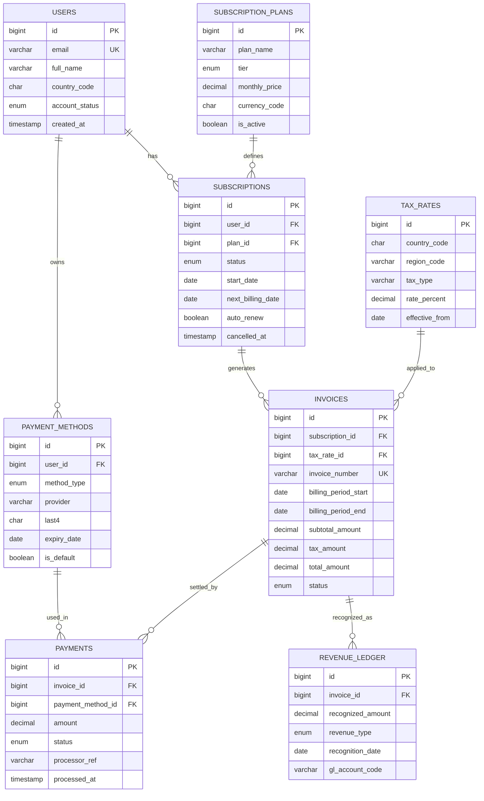

# 🎬 Netflix Billing & Subscription Database

Autonomous Relational Database Engine built from `netflix_billing_schema_erd.html`.  
Implemented using **SQLite 3**, the industry-standard lightweight, serverless, zero-configuration SQL relational database engine.

> ⚡ **Live Database Telemetry**: View all table records, relational foreign key lineages, and transaction flowcharts in [**`LIVE_DATABASE.md`**](LIVE_DATABASE.md).

---

## 📌 1. Project Overview & Architecture

This database models a production-grade billing, invoicing, and subscription lifecycle system for Netflix. It handles:
- Multi-tier subscription plans across international currencies (`USD`, `INR`, `EUR`, `GBP`).
- Multi-method user payment vaults (Credit Card, Debit Card, UPI, PayPal, Gift Cards).
- Multi-jurisdiction tax engine (US State sales taxes, India GST 18%, UK VAT 20%, Germany Mehrwertsteuer 19%).
- Automated billing cycle invoicing (Subtotal + Calculated Tax = Total).
- Payment settlement and gateway transaction tracking (`SUCCEEDED`, `FAILED`, `PENDING`).
- Revenue recognition journal ledger compliant with accounting standards (ASC 606 / IFRS 15).

---

## 🗄️ 2. Entity Relationship Diagram (ERD)



### Table Breakdown (8 Relational Tables)

| Table | Primary Key | Foreign Keys | Key Constraints & Details |
| :--- | :--- | :--- | :--- |
| **`USERS`** | `id` | - | `email` UNIQUE, `account_status` CHECK ENUM (`ACTIVE`, `SUSPENDED`, `CANCELLED`, `PENDING`) |
| **`SUBSCRIPTION_PLANS`** | `id` | - | `tier` CHECK ENUM (`STANDARD_WITH_ADS`, `BASIC`, `STANDARD`, `PREMIUM`), `monthly_price`, `currency_code` |
| **`TAX_RATES`** | `id` | - | `country_code`, `region_code`, `tax_type`, `rate_percent`, `effective_from` |
| **`SUBSCRIPTIONS`** | `id` | `user_id` -> `USERS(id)`<br>`plan_id` -> `SUBSCRIPTION_PLANS(id)` | `status` CHECK ENUM (`ACTIVE`, `PAST_DUE`, `CANCELLED`, `PAUSED`), `start_date`, `next_billing_date` |
| **`PAYMENT_METHODS`** | `id` | `user_id` -> `USERS(id)` | `method_type` CHECK ENUM (`CREDIT_CARD`, `DEBIT_CARD`, `PAYPAL`, `UPI`, `GIFT_CARD`), `last4`, `is_default` |
| **`INVOICES`** | `id` | `subscription_id` -> `SUBSCRIPTIONS(id)`<br>`tax_rate_id` -> `TAX_RATES(id)` | `invoice_number` UNIQUE, `subtotal_amount`, `tax_amount`, `total_amount`, `status` |
| **`PAYMENTS`** | `id` | `invoice_id` -> `INVOICES(id)`<br>`payment_method_id` -> `PAYMENT_METHODS(id)` | `amount`, `status` CHECK ENUM (`PENDING`, `SUCCEEDED`, `FAILED`, `REFUNDED`), `processor_ref` |
| **`REVENUE_LEDGER`** | `id` | `invoice_id` -> `INVOICES(id)` | `recognized_amount`, `revenue_type` CHECK ENUM (`SUBSCRIPTION`, `ADD_ON`, `AD_REVENUE`, `PENALTY`), `gl_account_code` |

---

## 🚀 3. Quick Start & Execution Guide

### Database Location:
- Target Database: `/home/ultron/Projects/netflix_billing_db/netflix_billing.db`
- DDL Schema: `/home/ultron/Projects/netflix_billing_db/schema.sql`
- Pure SQL Seed: `/home/ultron/Projects/netflix_billing_db/seed.sql`
- Automated Populator: `/home/ultron/Projects/netflix_billing_db/populate_db.py`
- Analytical Queries: `/home/ultron/Projects/netflix_billing_db/queries.sql`
- Terminal Explorer: `/home/ultron/Projects/netflix_billing_db/explore.py`
- Dedicated CLI Command: `/home/ultron/.local/bin/sql-netflix`

### ⚡ Global CLI Command: `sql-netflix`
Available globally in your terminal:
```bash
# 1. Launch interactive boxed SQL console (prompts for queries)
sql-netflix

# 2. Run a direct query with boxed terminal output
sql-netflix "SELECT id, full_name, email, country_code FROM USERS LIMIT 5;"

# 3. View database table counts matrix
sql-netflix tables

# 4. Run the assignment analytical query suite
sql-netflix queries
```

### 1. Rebuild or Reset the Database
```bash
cd /home/ultron/Projects/netflix_billing_db
python3 populate_db.py
```

### 2. Inspect Records with the ULTRON Explorer CLI
```bash
# View table record count matrix
./explore.py summary

# View specific tables
./explore.py users
./explore.py plans
./explore.py subscriptions
./explore.py invoices
./explore.py payments
./explore.py ledger
```

### 3. Open Interactive SQLite Shell
```bash
sqlite3 netflix_billing.db
```
Inside the prompt:
```sql
.tables
.schema USERS
SELECT * FROM USERS LIMIT 5;
.exit
```

### 4. Execute the Assignment Analytical Queries
```bash
sqlite3 netflix_billing.db < queries.sql
```

---

## 📊 4. Assignment Analytical Query Showcase

The file [`queries.sql`](file:///home/ultron/Projects/netflix_billing_db/queries.sql) contains 6 assignment queries:

1. **Active Subscribers & Payment Vaults**: Multi-table inner/left joins combining users, current active tiers, prices, and default payment provider.
2. **Monthly Recurring Revenue (MRR) Matrix**: Financial aggregations grouping recurring revenue by tier and international currency.
3. **Billing Reconciliation & Tax Audit**: End-to-end invoice settlement tracking showing gross subtotal, applied tax percentage, net total, and payment processor transaction reference.
4. **Tax Revenue Collected by Jurisdiction**: Summarizes total tax compliance yield by country (US, India GST, UK VAT, Germany VAT).
5. **ASC 606 Revenue Recognition Ledger**: General Ledger accounting breakdown by account codes (`4010-STREAMING-SUB`, `4020-AD-SUPPORTED-SUB`).
6. **Delinquency & Churn Audit**: Detects past due subscriptions and failed payment processor charges with error logs.
